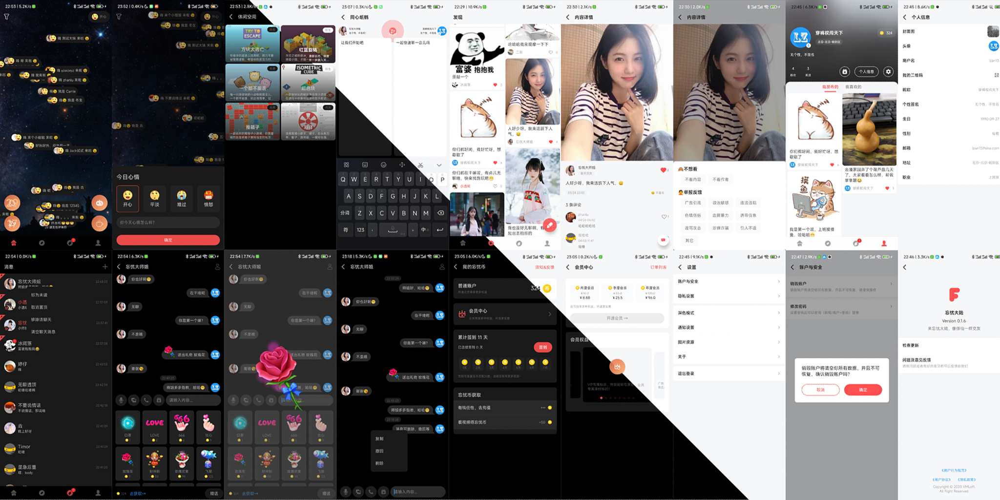

vmnepentheserver
======

忘忧大陆-修仙一样交友

分担忧愁，让烦恼减半 分享快乐，让乐趣加倍

帮助用户解决烦恼，忘记忧愁，放松心情，快乐交友等打造一站式社交平台，弹幕式心情分享，及新颖的即时聊天方式，带给用户不一样的交流体验，让用户之间的交流充满趣味性，提高心情愉悦度，达到忘记烦恼的目的。

<div align="center">
    
</div>


### 准备

运行本项目前确认你已配置好`nodejs`开发环境，并且已安装`mongodb`，如果不熟悉可以参考以下两篇文章：

- [Nvm 管理 Nodejs](https://mp.weixin.qq.com/s/MN_fhfw32FPj6rWs8Gdsyw)
- [Ubuntu 安装并配置 Mongodb](https://mp.weixin.qq.com/s/0CpwuH7XbpKU6ZsiOtrc6Q)

### 配置说明
`config`目录下添加了几个配置模板，需要自己根据需要复制相应的文件进行配置，复制文件后删除模板文件中的`template`即可，如` config.local.template.js`->`config.local.js`

```
config.local.template.js // 本地调试配置模板
config.pre.template.js // 线上调试配置模板
config.prod.template.js // 线上运行配置模板
config.unittest.template.js // 单元测试配置模板
```

### 本地开发

```
# 创建本地运行配置文件 config.local.js 修改配置文件内相关信息为自己的
$ cp config.local.template.js config.local.js
# 终端运行
$ npm i
$ npm run dev
$ open http://localhost:5920/

# 也可以导入`WebStorm`进行编译运行，工具栏选择 `Run->Edit Configurations` 添加 `npm` 运行，其中 `Scripts` 填 `debug`or`dev`
```

### 接口调试
这里方便大家调试，我把我的 `postman` 数据导出来了，大家可以导入到自己 `postman` 进行测试，接口文件放在了项目根目录下 `vmnepentheserver.postman.json`
不会用 `postman` 的话自行搜索下吧，很简单很方便

这里需要注意导入的只是接口数据，环境配置需要你自己进行配置，主要就是 `{{host}}` `{{Authorization}}` 这两个参数

### 上线发布

```
# 创建发布运行配置文件 config.prod.js 修改配置文件内相关信息为自己的
$ cp config.prod.template.js config.prod.js
# 安装发布依赖
$ npm i --production
# 打包发布代码
$ tar -czvf ../vmnepentheserver.tgz .

# 将打包的代码上传到要发布的服务器上，解包，运行
$ tar -xzvf vmnepentheserver.tgz .
$ ./vmrun.sh
# 完成之后运行单元测试初始化数据库
$ npm run test
```

### 域名配置

项目部署完成之后，默认只能通过`ip+port`来访问，一般正常项目都需要配置访问域名，这里我使用`nginx`说下我的配置，不一样的同学可以自己搜索所用服务器相关配置

```
# 首先进到 nginx 配置目录下，我的是 /etc/nginx/sites-available 下
$ cd /etc/nginx/sites-available
# 新建并编辑配置，这个名字可以随便取，内容参考下方配置
$ vim match
# 保存之后需要连接当前配置到 /etc/nginx/sites-enabled/ 下
$ ln -s /etc/nginx/sites-available/nepenthe /etc/nginx/sites-enabled/nepenthe
# 重启 nginx
$ /etc/init.d/nginx restart
```

### Nginx 代理配置

这里开启了`https`访问，证书用的是阿里云免费证书，一年有效期，到期需要自己更新，怎么申请免费证书不再赘述，记得修改其中的域名为自己的

```
server {
	listen 80;
	server_name nepenthe.vmloft.com;

	rewrite ^(.*)$ https://$host$1 permanent;
}
server {
	listen 443 ssl;
	server_name nepenthe.vmloft.com;

	ssl on;

	ssl_certificate     /var/www/certs/nepenthe.vmloft.com.pem;
	ssl_certificate_key	/var/www/certs/nepenthe.vmloft.com.key;
	ssl_ciphers         ECDHE-RSA-AES128-GCM-SHA256:ECDHE:ECDH:AES:HIGH:!NULL:!aNULL:!MD5:!ADH:!RC4;
	ssl_protocols		TLSv1 TLSv1.1 TLSv1.2;
	ssl_prefer_server_ciphers on;

	location / {
		root /var/www/vmnepenthe/home;
		index index.html;
		try_files $uri $uri/ = index;
	}
	location /admin {
		alias /var/www/vmnepenthe/admin;
		index index.html
		try_files $uri $uri/ = 404;
	}

	location /api {
		proxy_set_header   Upgrade $http_upgrade;
		proxy_set_header   Connection "upgrade";
		proxy_set_header   X-Forwarded-For $proxy_add_x_forwarded_for;
		proxy_set_header   X-Real-IP $remote_addr;
		proxy_set_header   Host $http_host;
		proxy_set_header   X-Forwarded-Proto $scheme;
		proxy_pass         http://127.0.0.1:5920;
	}
}
```

### 更多

**项目客户端下载体验**

- [本地 APK 包下载](http://app.melove.net/fwn)
- [GooglePlay 市场下载](https://play.google.com/store/apps/details?id=com.vmloft.develop.app.nepenthe)

**开源仓库地址**

- [gitee/VMTemplateAndroid](https://gitee.com/lzan13/VMTemplateAndroid) Android 客户端
- [gitee/vmtemplateadmin](https://gitee.com/lzan13/vmtemplateadmin) 管理端项目使用`vue3`+`vite`+`element-plus`
- [gitee/vmtemplatehome](https://gitee.com/lzan13/vmtemplatehome) 首页端项目使用`vue3`+`vite`
- [gitee/vmtemplateserver](https://gitee.com/lzan13/vmtemplateserver) 服务器端项目使用`eggjs`

**项目介绍说明**

- [Android 功能介绍](https://mp.weixin.qq.com/s/bZYNCkngSuYpYJfdwFFYlw)
- [服务器介绍说明](https://mp.weixin.qq.com/s/1D0VllcyolPL1ei7Ix9hfw)

- [更新记录](./UPDATE.md)

**沟通交流**
可以通过已下方式找到我，获取最新信息，以及技术支持

公众号: 穿裤衩闯天下

<div align="center">
    
</div>

QQ 群: 901211985 个人 QQ: 1565176197

<div align="center">
    
    
</div>

**支持赞助**

如果你觉得当前项目帮你节省了开发时间，想要支持赞助我的话 👍，可以扫描下方的二维码打赏请我吃个鸡腿 🍗，你的支持将鼓励我继续创作 👨‍💻‍，感谢 ☺️ [赞助列表](./sponsor.md)

<div align="center">
    
    
</div>

### LICENSE

[MIT License Copyright (c) 2022 lzan13](./LICENSE)
